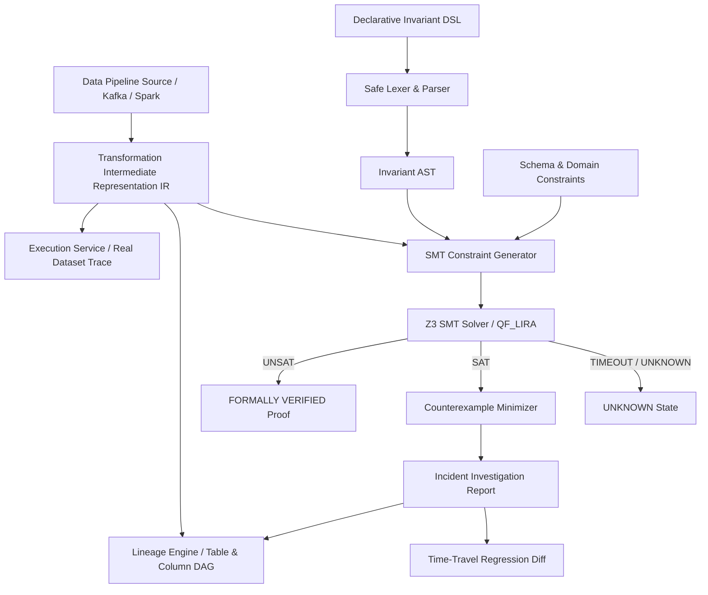

# TraceLake-V Architecture Specification

## 1. System Overview

TraceLake-V is a developer instrument for verifying that data transformations preserve declared business invariants.
Unlike traditional observability tools that only detect statistical anomalies or schema drifts post-execution, TraceLake-V formulates the transformation logic into First-Order Logic constraints and queries the **Z3 SMT Solver** to mathematically prove soundness or generate minimal concrete counterexamples.

## 2. Symbolic Transformation IR

The Symbolic Engine parses a controlled Intermediate Representation (IR) covering deterministic relational operations:
- `FILTER`: Predicates over numeric, string, or boolean columns.
- `SELECT` / `MAP`: Arithmetic or column projections.
- `RENAME`: Schema column aliasing.
- `AGGREGATE_SUM`: Grouped or global summations.
- `AGGREGATE_COUNT`: Cardinality preservation.
- `JOIN`: Equi-joins across datasets.
- `DROP_NULLS`: Partition column null filtering.

## 3. Z3 Constraint Encoding

For an input dataset domain $D$, a transformation $T: D \to O$, and a declared business invariant $Inv(D, O)$:
1. Domain validity constraints $C_{in}(x)$ are asserted (e.g. $x.amount > 0, x.status \in \{\text{PAID}, \text{REFUNDED}, \text{PENDING}\}$).
2. The transformation relation $R_T(x, y)$ is encoded.
3. The invariant assertion condition $Inv(x, y)$ is encoded.
4. Z3 is queried for satisfiability of:
$$\exists x, y : C_{in}(x) \land R_T(x, y) \land \neg Inv(x, y)$$

- **UNSAT**: No valid input record can violate $Inv$. Result: **FORMALLY VERIFIED**.
- **SAT**: Z3 yields a satisfying assignment $M$. Result: **FORMALLY VIOLATED** with concrete counterexample record.
- **UNKNOWN**: Transformation contains non-linear or blackbox operations outside the logic model.

## 4. Counterexample Minimization Algorithm

Upon receiving a SAT model:
1. Active variables directly implicated in the negated invariant formula are extracted.
2. Unrelated fields (such as timestamp or irrelevant metadata) are pruned.
3. The difference impact ($\Delta = \text{Expected} - \text{Actual}$) is computed.
4. The exact transformation node in the lineage DAG where the drop occurred is identified as the **Root Cause**.
